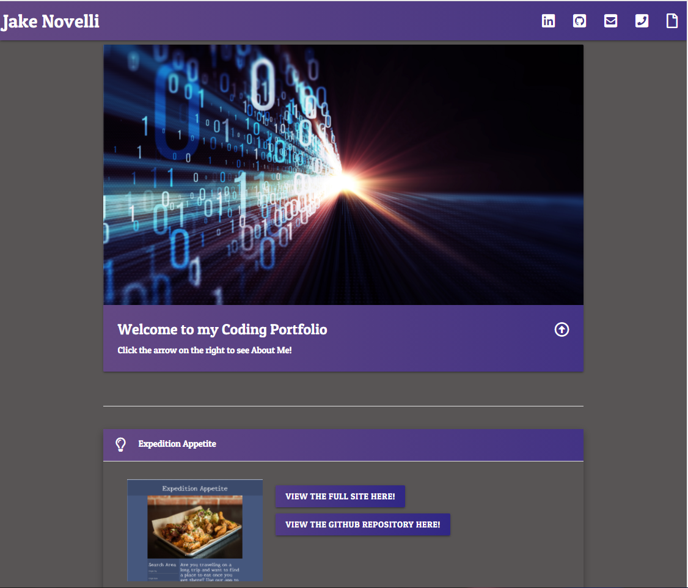
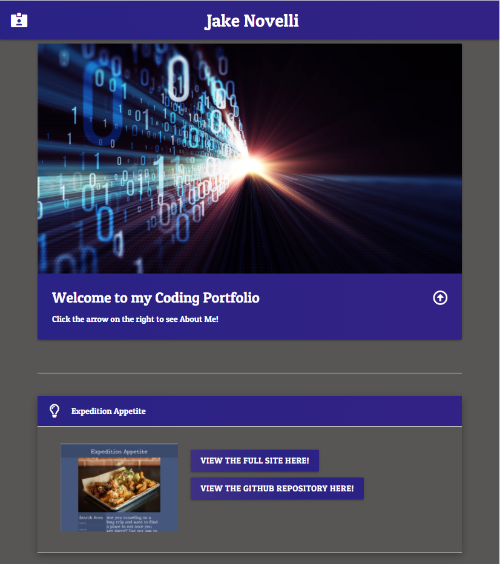
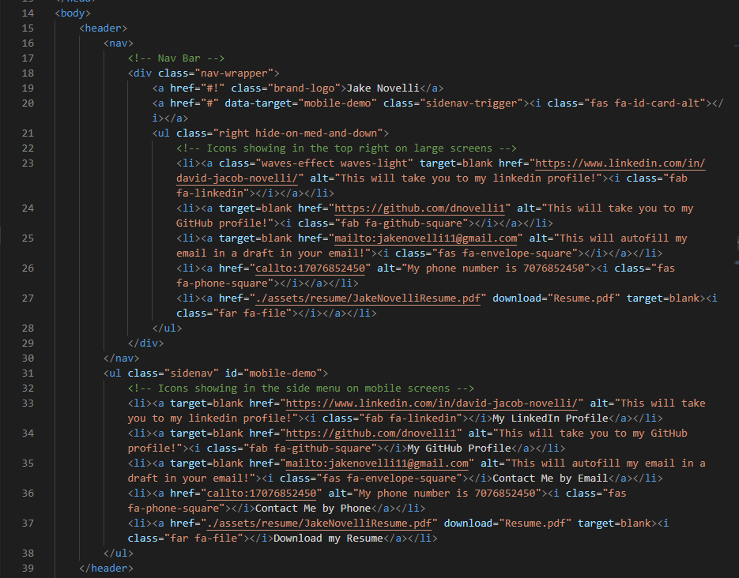

# Updated Portfolio

## In this homework assignment I was prompted with the task of updating my professional coding portfolio grab the attention of employers who are seeking me for employment. This was a different type of task. I was able to put my own touch on my code more than usual. I believe this site is appealing and extremely easy to use. Designed for mobile first. I am proud of the 4 projects I have displayed. They may not be the most appealng, but at least they are an example of the progress being made during the course of this class.

## Technology I Put to Work
- GitHub - repository storage for the project in order to amke changes, deploy them and push to a main branch. 

- GitBash - used for written commands and communicating with the repository stored on GitHub.

- HTML - used to create and edit electronic documents stored on the web.

- CSS - used to edit style and appearance of the website.

- Materialize.css - component library used with the combination of CSS, HTML and Javascript all in one. Used to display consistency and cleanliness on a webpage. Including:
    - Collapsible Popup Containers
    - Buttons
    - Event Listeners/Functions
    - NavBar/Mobile Menu

- Google Fonts - fonts offered by google to maximize appeal to a user on your website.

## Site Previews

Desktop Preview

Mobile Preview

## How it was Made!

HTML

## Here is a link to my Full Portfolio!

[Full-Site](https://dnovelli1.github.io/updatedportfolio/)

## Links to my other Professional Site's!

[LinkedIn](https://www.linkedin.com/in/david-jacob-novelli/)

[GitHub](https://github.com/dnovelli1)

## License

Licensed under the [MIT License](LICENSE).
